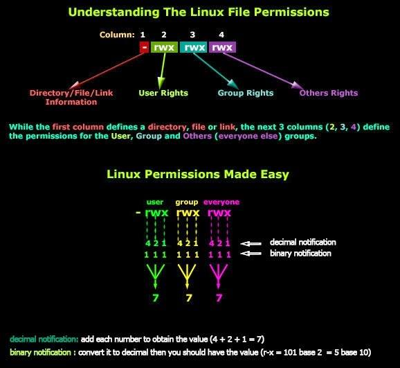

# Unix Basics

## Connecting to `state`

You will first need to connect through `acc.ohsu.edu`

```
ssh laderast@acc.ohsu.edu
```

Once you're in there:

```
ssh state
```

## `pwd` - where am I?

When you sign into your account, you'll be in your *home directory* - this is a directory that houses your files

What is the absolute path to here? You can use `pwd` to find it.

```
pwd
```

## Home Directory Shortcut: `~/`

There is a built in shortcut for your home directory: `~/`

```
cd ~/
```

## File Permissions

`chmod` - please read up on file permissions.



https://haritibcoblog.com/2015/02/08/linux-concepts-filedirectory-permissions/


## Finding Software

What version of R?

`which R`


## Environment Variables

How does Unix know where software is located?

It has to do with providing an *environment* variable.

The one you should be familiar with is `$PATH`, which is a list of directories that linux looks to find software.


```
echo $PATH
```

## Adding software to your `PATH` using a `.bashrc` file


We will be using our `.bashrc` file to alter settings in our shell, including our `$PATH`. 


```
export PATH="/home/users/laderast/bwa-0.7.17/:$PATH"
```


## Editing your `.bashrc` using `nano`

Make sure you're in your home directory!

```
cd ~/
```

Then open `nano`:

```
nano .bashrc
```

## Note: `.bashrc` lives in your home directory, not elsewhere!


Add the export line to your file:

```
export PATH="/home/users/laderast/bwa-0.7.17/:$PATH"
```

Save and exit (control-x)


## `source`

If you've made changes to your `.bashrc`, then everytime you log in or open a shell, you will execute the contents of `.bashrc`.

If you made a change and want it to run in your current session, you can use `source`:

```
source ~/.bashrc
```

## Check your path and try running bwa

```
echo $PATH

bwa
```

## What did we just learn?

- environment variables (`$HOME` and `$PATH`)
- `export`
- `.bashrc` files
- `nano` for file editing
- adding to our `$PATH` variable
- `source` our `.bashrc`

## `alias`

If you have installed a different version of R, you can create an *alias* in your `.bashrc`:

`alias R2=/usr/bin/R`

Try editing your `.bashrc` to add this line. Then, `source` it.


## Job Control: `ps` and `kill`

Finding all jobs that you're running:

```
ps -u laderast
```

Killing a job using `kill` (only works on your jobs)

```
kill [jobnum]
```

## End of Day 1


## Very Helpful: `tmux`

# Dependencies Manager: `conda` and `miniconda`

## (optional) HOSTNAME specific commands


When you are using multiple hosts on the same account, 

```
if [[ "$HOSTNAME" = state ]]; then
    export PATH="$HOME/FastQC/:$PATH"
elif [[ "$HOSTNAME" = exahead1 ]]; then
    export PATH="/usr/bin/FastQC"
fi

```